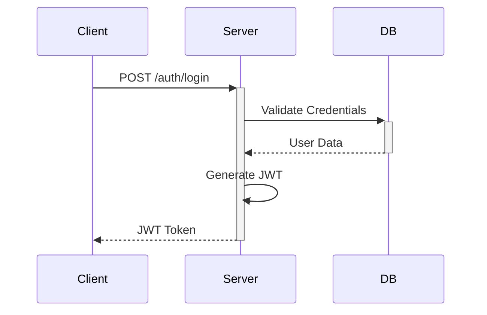
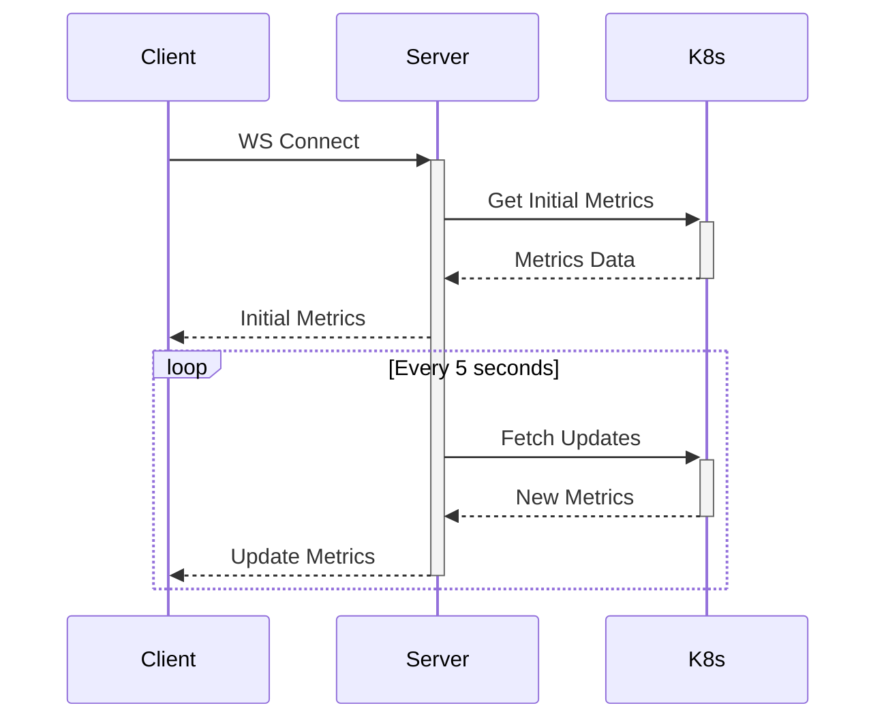

# Bloomberg PaaS-Style Container Management Dashboard

## Overview
A production-ready container management dashboard demonstrating modern cloud-native development practices and container orchestration capabilities. This project implements a scalable Platform-as-a-Service (PaaS) architecture with real-time monitoring, robust authentication, and automated deployment capabilities.

## Key Features

### Authentication & Authorization
- 🔐 JWT-based authentication system
- 👥 Role-based access control (RBAC)
- 🔑 Secure password hashing with bcrypt
- 🚫 Guard-based route protection

### Real-time Monitoring
- ⚡ WebSocket-based real-time metrics
- 📊 Live container status updates
- 📈 Resource usage tracking
- 🔄 Automatic reconnection handling

### Dashboard Interface
- 📱 Responsive design with Tailwind CSS
- 📉 Interactive charts using Recharts
- 🎯 Real-time status indicators
- 🎨 Modern UI components from shadcn/ui

### Deployment Management
- 🚀 Kubernetes native deployment
- ⚖️ Resource quota management
- 🔄 Rolling updates support
- 🏷️ Environment variable management

### CI/CD Pipeline
- 🔄 Automated testing and deployment
- 🐳 Docker image building
- 📦 Container registry integration
- 🚀 Kubernetes deployment automation

## Tech Stack
- **Backend:**
  - NestJS with TypeScript
  - Socket.IO for WebSocket
  - JWT for authentication
  - @kubernetes/client-node
  
- **Frontend:**
  - React/Next.js
  - TypeScript
  - TailwindCSS
  - Recharts
  - shadcn/ui components
  
- **Infrastructure:**
  - Docker
  - Kubernetes
  - GitHub Actions
  - Redis (for session management)
  - PostgreSQL (for user management)

## Getting Started

### Prerequisites
- Node.js >= 18
- Docker
- Kubernetes cluster (local or remote)
- kubectl configured with cluster access
- Redis
- PostgreSQL

### Local Development Setup

1. **Clone the repository**
```bash
git clone https://github.com/ceteongvanness/container-management-dashboard.git
cd container-management-dashboard
```

2. **Environment Configuration**
```bash
# Backend environment setup
cd backend
cp .env.example .env

# Configure the following variables:
# JWT_SECRET=your_jwt_secret
# DB_HOST=localhost
# DB_PORT=5432
# DB_USER=your_db_user
# DB_PASSWORD=your_db_password
# REDIS_HOST=localhost
# REDIS_PORT=6379
```

3. **Backend Setup**
```bash
cd backend
npm install
npm run migration:run  # Set up database schema
npm run start:dev
```

4. **Frontend Setup**
```bash
cd frontend
npm install
cp .env.example .env
npm run dev
```

5. **Start Redis and PostgreSQL**
```bash
# Using Docker
docker compose up -d redis postgres
```

### Authentication Setup

1. **Create an initial admin user**
```bash
npm run create:admin
```

2. **Login using the admin credentials**
```bash
curl -X POST http://localhost:3000/auth/login \
  -H "Content-Type: application/json" \
  -d '{"username": "admin", "password": "your_password"}'
```

### WebSocket Metrics

1. **Subscribe to metrics**
```typescript
// In your frontend code
const socket = new WebSocket('ws://localhost:3000/metrics');
socket.onmessage = (event) => {
  const metrics = JSON.parse(event.data);
  // Handle metrics update
};
```

### Kubernetes Deployment

1. **Create Kubernetes secrets**
```bash
kubectl create secret generic app-secrets \
  --from-literal=JWT_SECRET=your_jwt_secret \
  --from-literal=DB_PASSWORD=your_db_password
```

2. **Deploy the application**
```bash
kubectl apply -f k8s/development/
```

### Running the CI/CD Pipeline

1. **Configure GitHub Secrets**
- `KUBE_CONFIG_DATA`: Base64-encoded kubeconfig
- `DOCKER_USERNAME`: Container registry username
- `DOCKER_PASSWORD`: Container registry password

2. **Push to trigger deployment**
```bash
git push origin main
```

## Component Documentation

### Authentication Flow


### WebSocket Metrics Flow


## API Documentation

### Authentication Endpoints
- `POST /auth/login`: Login user
- `POST /auth/register`: Register new user
- `GET /auth/profile`: Get user profile

### Metrics Endpoints
- `GET /metrics`: Get current metrics
- `WS /metrics`: Subscribe to real-time metrics

### Deployment Endpoints
- `POST /deployments`: Create new deployment
- `GET /deployments`: List deployments
- `PUT /deployments/:id`: Update deployment
- `DELETE /deployments/:id`: Delete deployment

## Contributing
1. Fork the repository
2. Create your feature branch (`git checkout -b feature/amazing-feature`)
3. Commit your changes (`git commit -m 'Add some amazing feature'`)
4. Push to the branch (`git push origin feature/amazing-feature`)
5. Open a Pull Request

## Testing

### Running Tests
```bash
# Backend tests
cd backend
npm run test
npm run test:e2e

# Frontend tests
cd frontend
npm run test
```

### Test Coverage
```bash
# Generate coverage reports
npm run test:cov
```

## Monitoring and Logging

### Metrics Collection
- Container CPU usage
- Memory consumption
- Network I/O
- Pod status
- Deployment status

### Logging
- Request logging
- Error tracking
- Audit logging
- Performance metrics

## License
This project is licensed under the MIT License - see the [LICENSE](LICENSE) file for details.

## Support
For support, please open an issue in the GitHub repository or contact the maintainers.
